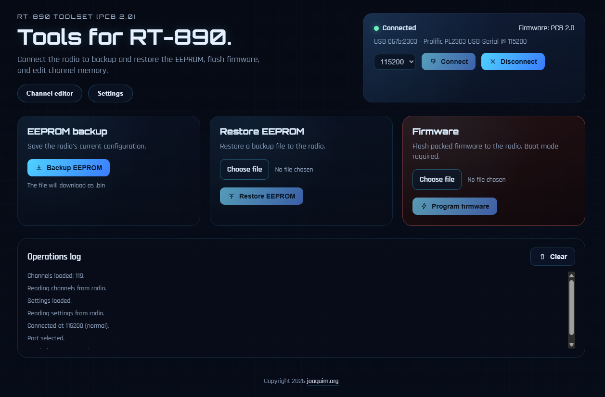

# RT-890 Toolset (PCB 2.0)

Web app to manage the Radtel RT-890 (PCB 2.0) directly in the browser using Web Serial.

https://home.joaquim.org/890

## Features

- **Web Serial connection** (Chrome/Edge).
- **EEPROM backup and restore**.
- **Firmware flashing** (bootloader mode).
- **Channel editor** with read/write, JSON import/export, search, and advanced columns.
- **Settings** (Basic, DTMF, Startup, TX Allow) with read/write from EEPROM.
- **Operations log** and progress feedback.

## Requirements

- Browser with Web Serial support: Chrome or Edge.
- Compatible USB/serial cable for the RT-890.

## Development

1. Install dependencies: `npm install`
2. Start the dev server: `npm run dev`
3. Build for production: `npm run build`

## Notes

- For firmware flashing, the radio must be in **bootloader mode**.
- For settings and channels, use **Read** before editing and writing back.
- Channel limit is **999**.

## License

MIT License. See `LICENSE` and `NOTICE`.